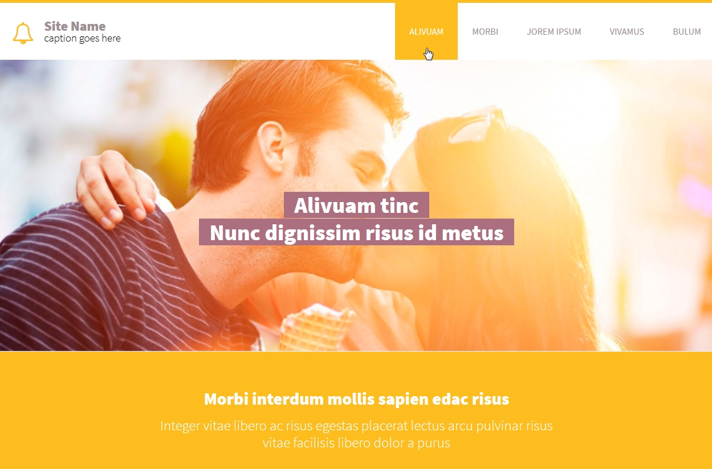
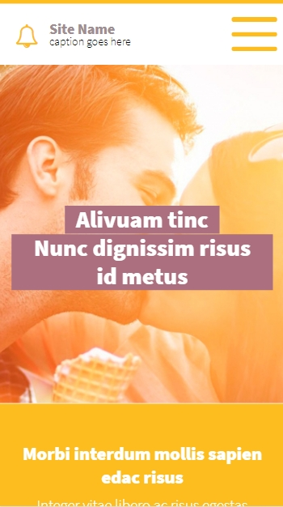
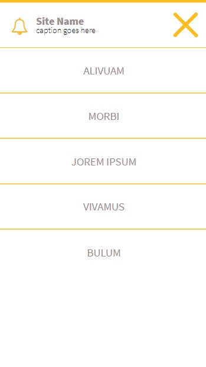

# joremipsum
Ссылка: https://alexaltrex.github.io/joremipsum

## Описание
Верстка одностраничного сайта.

## Запуск проекта:
1. Клонирование и запуск: git clone https://github.com/Alexaltrex/SolidCompas.git;
2. Переход в директорию с проектом: cd SolidCompas;
3. Запуск файла index.html;

## Цель проекта
* Изучение верстки, предпроцессора SASS (SCSS);

## Разработка
* Код - js;
* Верстка - предпроцессор SASS (конкретно SCSS);
* Адаптивный дизайн, поддержка мобильной версии;
* Слайдер slick;
* Адаптивное меню;

